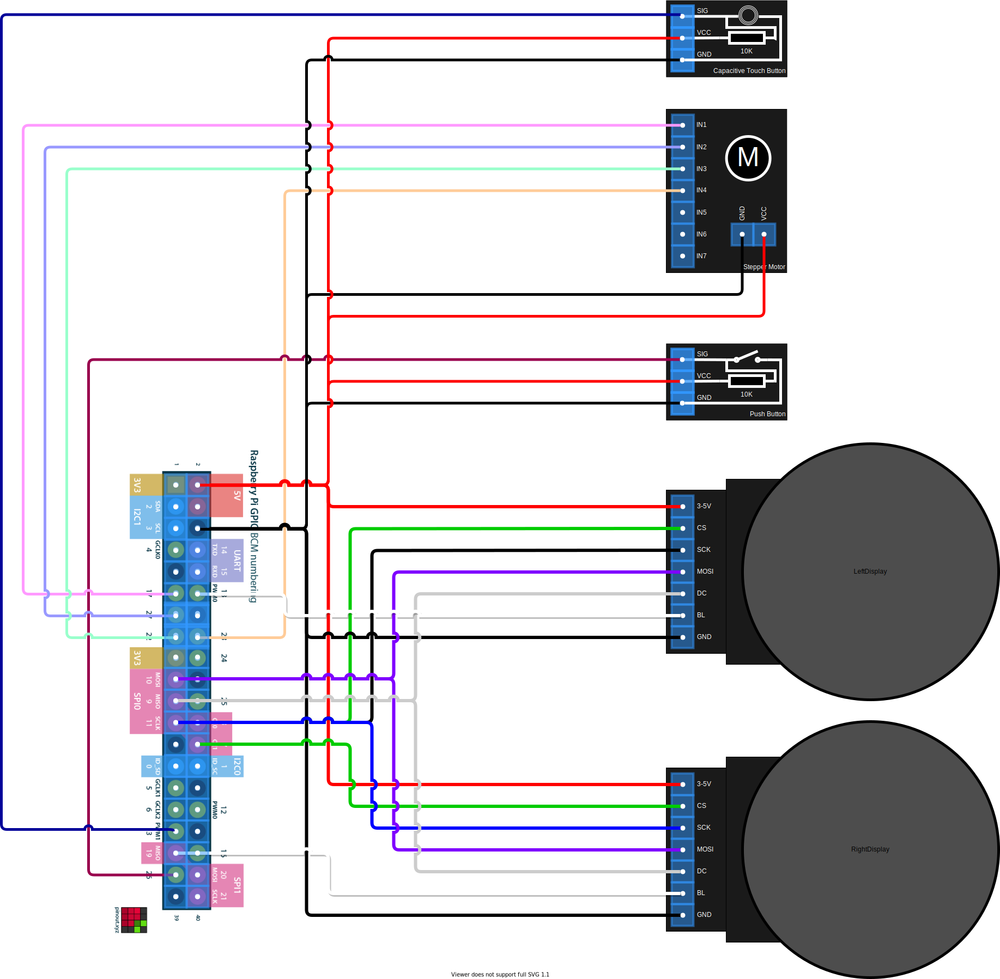

# CSP354 Project

Author: [Benjamin Dodd (1901386)](https://www.github.com/mitgobla)

## Description

Software implementation of the soft-toy interactive robot.

## Setup

**Note:** This project requires specific hardware to run.

1. Ensure Python 3.7 is installed on your Raspberry Pi.
2. Run `pip install -r requirements.txt` to install the required Python packages.
3. Run the main script with `python3 -m main.run`.

To try specific modules, run: `python3 -m main.<module_parent>.<module_name>` where `<module_parent>` and `<module_name>` are listed below.

### Modules

- `display.circular_display` - Displays the video feed onto both screens.
- `motor.stepper_motor` - Moves the stepper motor.
- `camera.emotion_detection` - Detects emotions from the video feed.
- `camera.gesture_detection` - Detects number of fingers shown from the video feed.
- `threading.worker_thread` - Runs a worker thread.

## Circuit Diagram

